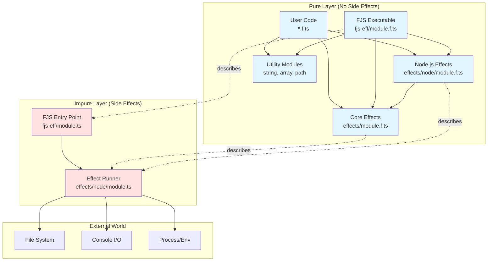
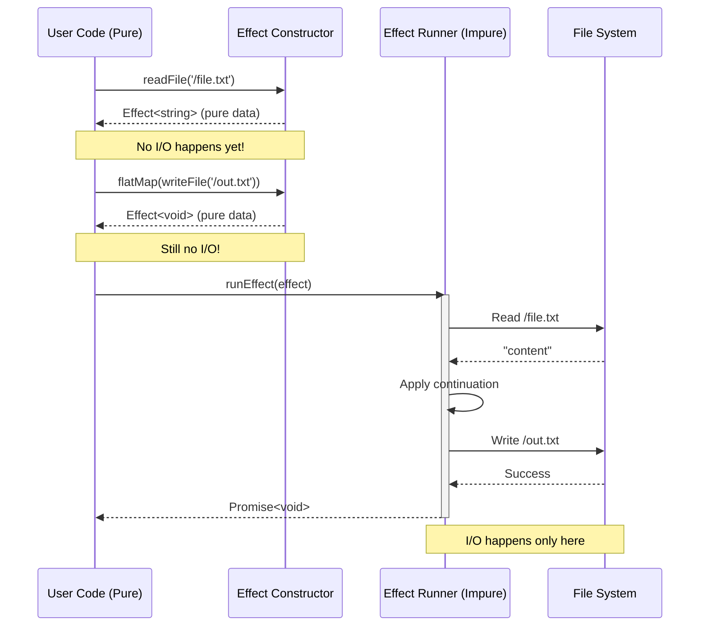
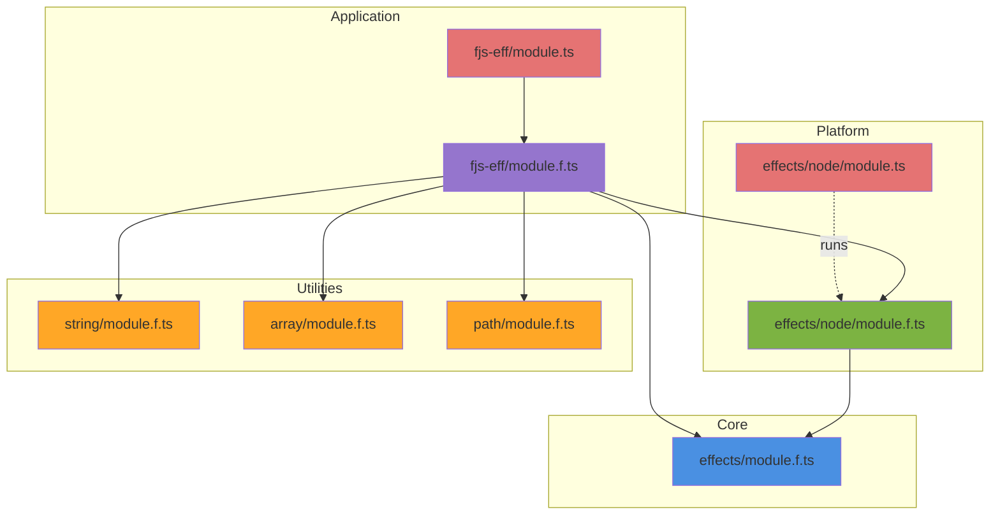
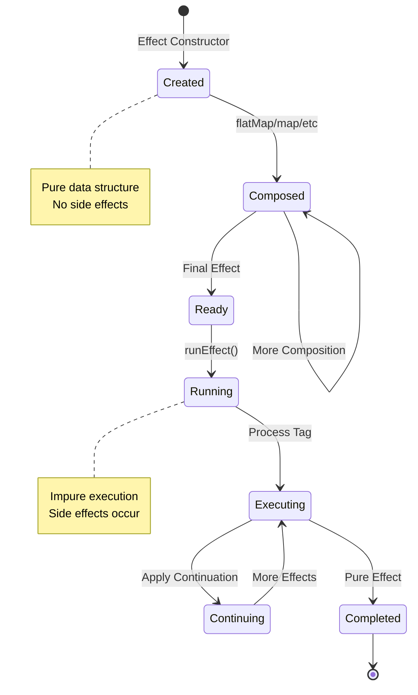
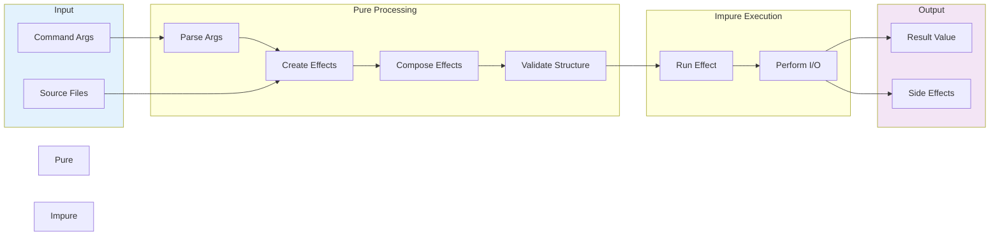

# Architecture Diagram

## System Overview



## Effect Flow



## Effect Composition

```mermaid
graph LR
    subgraph "Effect Chain"
        A[readFile<br/>path.txt] -->|flatMap| B[Transform<br/>content]
        B -->|flatMap| C[writeFile<br/>out.txt]
        C -->|flatMap| D[stdOut<br/>Success!]
    end
    
    subgraph "Pure Data Structure"
        E[Effect: readFile<br/>tag: 'readFile'<br/>payload: 'path.txt'<br/>cont: ...] --> F[Effect: writeFile<br/>tag: 'writeFile'<br/>payload: {...}<br/>cont: ...]
        F --> G[Effect: stdOut<br/>tag: 'stdOut'<br/>payload: 'Success!'<br/>cont: ...]
    end
    
    A -.represents.-> E
    C -.represents.-> F
    D -.represents.-> G
```

## Testing Strategy

```mermaid
graph TB
    subgraph "Testing Pure Effects"
        T1[Create Effect] --> T2[Inspect Structure]
        T2 --> T3[Test Continuation]
        T3 --> T4[Verify Result]
    end
    
    subgraph "Testing with Mocks"
        M1[Create Effect] --> M2[Create Mock Handlers]
        M2 --> M3[Run with runMock]
        M3 --> M4[Verify Result]
    end
    
    subgraph "Integration Testing"
        I1[Create Effect] --> I2[Run with runEffect]
        I2 --> I3[Verify Real I/O]
    end
    
    style T1 fill:#d4edda
    style M1 fill:#fff3cd
    style I1 fill:#f8d7da
```



## Module Dependencies



## Effect Lifecycle



## Data Flow


