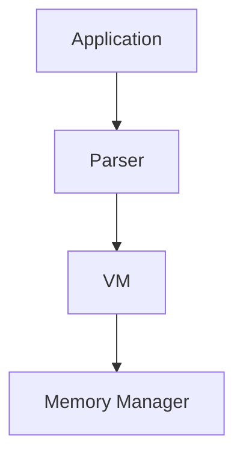

# NaNVM rearchitecture

About a year ago (Nov 2023), the FunctionalScript team started a new project that's called [NaNVM](https://github.com/functionalscript/nanvm). We only have a few resources (⌛💰) for the projects, so it takes a while. Anyway, since then we've implemented from scratch several things in Rust:
- An interface and multiple implementations for [Memory Management](https://github.com/functionalscript/nanvm/tree/main/nanvm-lib/src/mem), such as:
  - a [global](https://github.com/functionalscript/nanvm/blob/main/nanvm-lib/src/mem/global.rs) memory manager using standard `alloc/dealloc`,
  - a [local](https://github.com/functionalscript/nanvm/blob/main/nanvm-lib/src/mem/local.rs) manager with a reference counter,
  - a simple [arena](https://github.com/functionalscript/nanvm/blob/main/nanvm-lib/src/mem/arena.rs) implementation.
- [BigInt](https://github.com/functionalscript/nanvm/blob/main/nanvm-lib/src/big_numbers/big_int.rs),
- [All FS data types](https://github.com/functionalscript/nanvm/tree/main/nanvm-lib/src/js) in the VM:
  - [string](https://github.com/functionalscript/nanvm/blob/main/nanvm-lib/src/js/js_string.rs),
  - [bigint](https://github.com/functionalscript/nanvm/blob/main/nanvm-lib/src/js/js_bigint.rs),
  - [array](https://github.com/functionalscript/nanvm/blob/main/nanvm-lib/src/js/js_array.rs),
  - [object](https://github.com/functionalscript/nanvm/blob/main/nanvm-lib/src/js/js_object.rs),
  - [any](https://github.com/functionalscript/nanvm/blob/main/nanvm-lib/src/js/any.rs).
- And, of course, we've implemented a parser for JSON and DJS (Data JavaScript). And it works very well. See [the article about DJS](https://medium.com/@sasha.gil/bridging-the-gap-from-json-to-javascript-without-dsls-fee273573f1b) for more information.

All of this code is written in Rust. And here's the problem. Rust is an excellent system-level programming language, but, like many other system-level PLs, it sucks when you need to work with high-level and business logic. So, it's very good to implement a memory manager, a VM, a big integer, etc., but it's very slow and complex to implement such things as a parser. And yes, we are aware of third-party parser generators. So we want to use some high-level language for that. Of course, we don't need to search for one because we already have FunctionalScript and JavaScript as glue. Also, because of our minimal resources, we would like to use only a few repositories. So, we plan to merge NaNVM code into the [FunctionalScript](https://github.com/functionalscript/functionalscript) repo.

Before we start rearchitecting the project, we should understand our current architecture. Here's a module dependency graph for [nanvm_lib](https://github.com/functionalscript/nanvm/tree/main/nanvm-lib/src):

