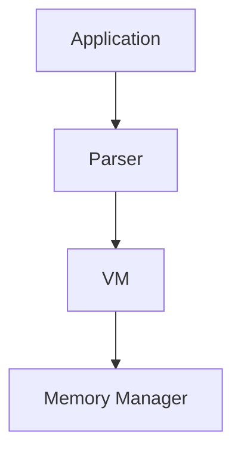
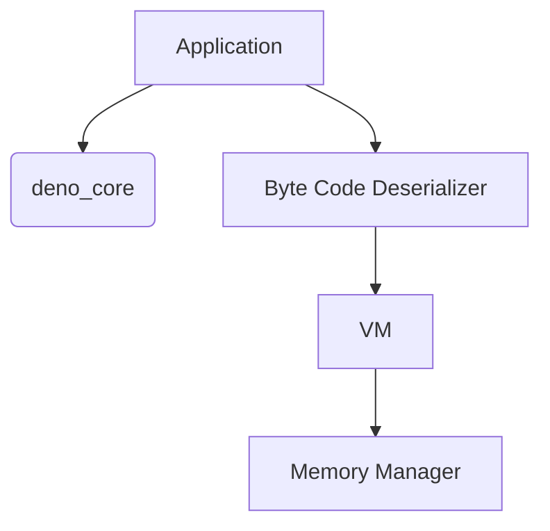
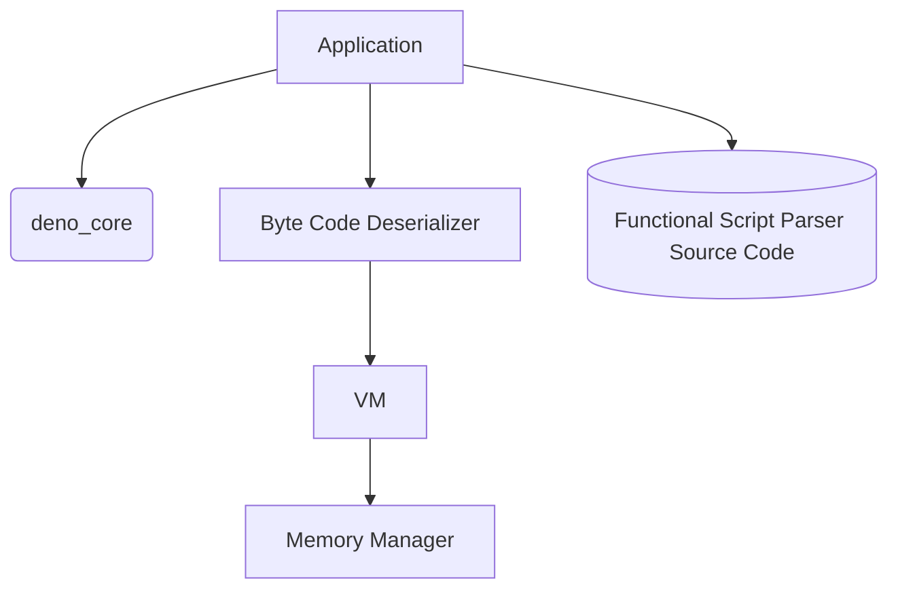
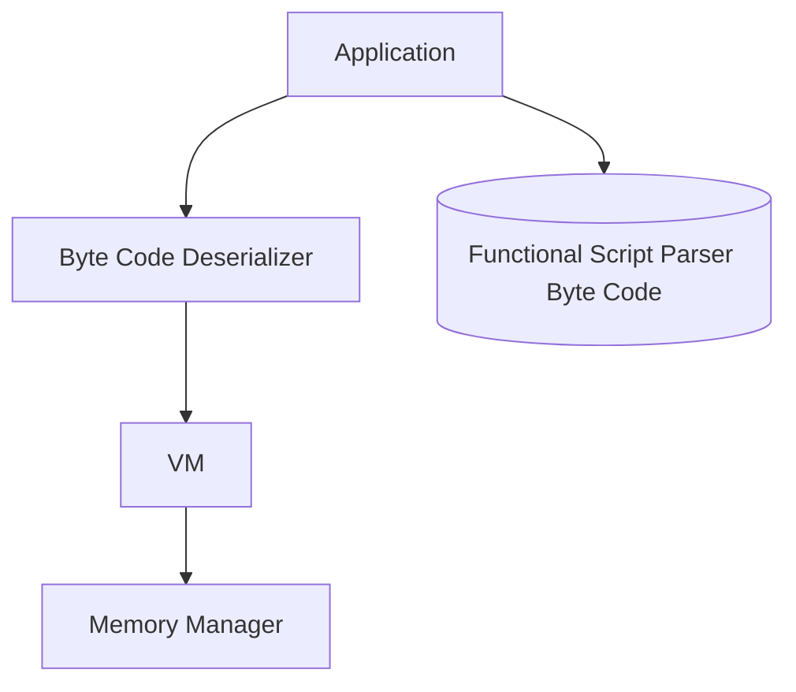

# FunctionalScript NaNVM Re-Architecture

About a year ago (Nov 2023), the FunctionalScript team started a new project called [NaNVM](https://github.com/functionalscript/nanvm). We have limited resources (⌛💰) for the projects, so progress has been slow. If you'd like to speed it up, please consider [sponsoring the project ❤️](https://opencollective.com/functionalscript). Since then, we’ve implemented several components from scratch in Rust:
- An interface and multiple implementations for [Memory Management](https://github.com/functionalscript/nanvm/tree/main/nanvm-lib/src/mem), such as a [global](https://github.com/functionalscript/nanvm/blob/main/nanvm-lib/src/mem/global.rs) memory manager using standard `alloc/dealloc`, a [local](https://github.com/functionalscript/nanvm/blob/main/nanvm-lib/src/mem/local.rs) manager with a reference counter, and a simple [arena](https://github.com/functionalscript/nanvm/blob/main/nanvm-lib/src/mem/arena.rs) implementation.
- [All FS data types](https://github.com/functionalscript/nanvm/tree/main/nanvm-lib/src/js) in the VM, sich as [string],(https://github.com/functionalscript/nanvm/blob/main/nanvm-lib/src/js/js_string.rs), [bigint](https://github.com/functionalscript/nanvm/blob/main/nanvm-lib/src/js/js_bigint.rs), [array](https://github.com/functionalscript/nanvm/blob/main/nanvm-lib/src/js/js_array.rs), [object](https://github.com/functionalscript/nanvm/blob/main/nanvm-lib/src/js/js_object.rs), and [any](https://github.com/functionalscript/nanvm/blob/main/nanvm-lib/src/js/any.rs).
- And, of course, we've implemented a parser for JSON and DJS, which works well. See [this article about DJS](https://medium.com/@sasha.gil/bridging-the-gap-from-json-to-javascript-without-dsls-fee273573f1b) for more information.

All of this code is written in Rust. However, here’s the problem: Rust is an excellent system-level programming language, but developers often struggle when working with high-level and business logic. While Rust excels at runtime performance, developing components like parsers in Rust can be slow and complex due to its verbose syntax and strict type system. It’s great for implementing a memory manager, a VM, or a big integer but less suited for tasks like implementing a parser efficiently (and yes, we are aware of third-party parser generators). That’s why we want to use a high-level language for this purpose. Of course, we don't need to search for one because we already have FunctionalScript and JavaScript as glue. Additionally, because of our limited resources, we aim to use only a few repositories. As a result, we plan to merge the NaNVM code into the [FunctionalScript](https://github.com/functionalscript/functionalscript) repo.

## Stage 0: Current State

Before we start rearchitecting the project, we should understand our current architecture. Here's the current module dependency graph for [nanvm_lib](https://github.com/functionalscript/nanvm/tree/main/nanvm-lib/src):



The parser is written in Rust using VM types, such as `JsString` and `JsBigInt`.

## Stage 1: Using a Third-Party JS Engine for Parsing

Because FunctionalScript is a subset of JavaScript, we can use third-party JavaScript engines to bootstrap our parser, written on FunctionalScript, without circular dependencies. In Rust, we only need to implement a generic byte code deserializer that reads byte code and invokes VM API functions. We've decided to use [Deno](https://deno.com/) and its [deno_core](https://crates.io/crates/deno_core/) package as a third-party JS engine because it's also written in Rust, has a crate and it's easy to integrate with our project.



### Requirements 
1. To restore previous functionality, we still need a parser that can convert FunctionalScript or DJS into byte code,
2. We have to design byte code for FunctionalScript and implement its deserializer in Rust.

### Build Process

To satisfy the first requirement we need a parser written in FunctionalScript. Then build process should take the parser source code and embed it into the application. See [include_str](https://doc.rust-lang.org/std/macro.include_str.html) for more details.



### Run-Time Process

1. The application loads the parser source code from memory into the Deno engine.
2. The application executes the parser in the JS engine with the command-line parameters provided by the user.
3. After the parser generates the byte code, the application sends this byte code to the VM.

This stage should be temporary until our parser can parse itself.

## Stage 2: Moving the Deno into `dev-dependencies`

Once our parser can parse itself and convert it into byte code, we can move the `deno_core` to development dependencies. This means that we need it only for build time.

### Build Process

1. Run the parser on itself using Deno and generate byte code for the parser.
2. Embed the generated byte code into our application ([include_bytes](https://doc.rust-lang.org/std/macro.include_bytes.html)).

### Run-Time Process



The application can do two things:
1. Convert FunctionalScript code into byte code using the parser source code and the VM.
2. Execute byte code using the VM.

## Byte code

The byte code format is designed for fast and straightforward deserialization and doesn't depend on a particular VM implementation.

### Requirements

- **Simple deserializion**:
    - `string`: UTF16
    - `number`: in a binary format
    - `bigint`: in a binary format
    - `usize`: u32
- **No imports**: byte code describes a standalone module without dependencies. A parser should resolve all imports.
- **No syntax sugar**: a parser should convert all syntax sugar operations into basic commands.
- **One unit is one byte**: Byte code can be serialized into a byte array or a file.
- **Least significant byte first**: Our `bigint` implementation is LSB first, and most current CPU architectures are.

### Pseudo-Code for the byte code binary format

We use syntax that looks like Rust to describe the binary format.

```rust
struct Array<T> {
    len: u32,
    array: [T; self.len],
}
 
type String = Array<u16>;

// LSB first.
type BigUInt = Array<u64>;

type Object = Array<(String, Any)>;

type Tag = u8

// This is the main structure for serialization.
type Code = Array<u8>;
```

### Tags/commands for JSON and DJS.

|format|any           |Tag|                       |
|------|--------------|---|-----------------------|
|JSON  |null          | 00|                       |
|      |number        | 01|u64                    |
|      |false         | 02|                       |
|      |true          | 03|                       |
|      |string        | 04|String                 |
|      |object        | 05|Object                 |
|      |array         | 06|Array<Any>             |
|DJS   |reference     | 07|u32                    |
|      |bigint+       | 08|BigUInt                |
|      |bigint-       | 09|BigUInt                |

We will add new tags for FunctionalScript byte code in the future as they are not needed for Stage 1.
