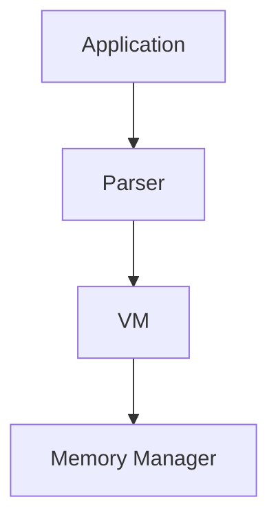
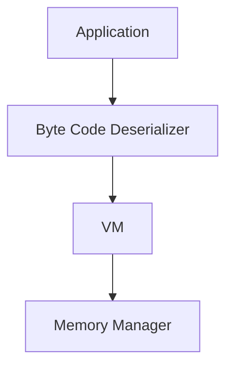
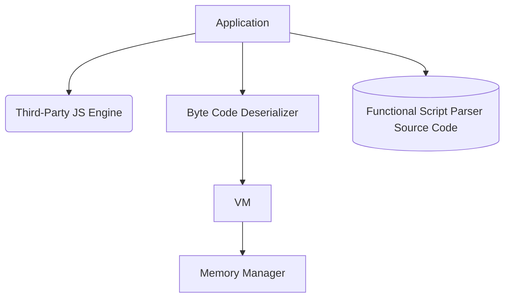
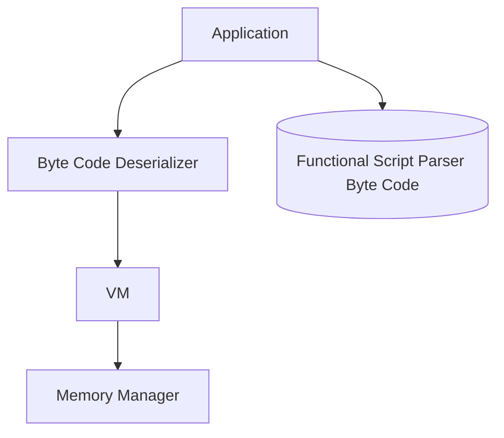

# FunctionalScript NaNVM re-architecture

About a year ago (Nov 2023), the FunctionalScript team started a new project that's called [NaNVM](https://github.com/functionalscript/nanvm). We only have a few resources (⌛💰) for the projects, so it takes a while. If you would like to speed it up, please consider [sponsoring the project](https://opencollective.com/functionalscript). Anyway, since then we've implemented from scratch several things in Rust:
- An interface and multiple implementations for [Memory Management](https://github.com/functionalscript/nanvm/tree/main/nanvm-lib/src/mem), such as:
  - a [global](https://github.com/functionalscript/nanvm/blob/main/nanvm-lib/src/mem/global.rs) memory manager using standard `alloc/dealloc`,
  - a [local](https://github.com/functionalscript/nanvm/blob/main/nanvm-lib/src/mem/local.rs) manager with a reference counter,
  - a simple [arena](https://github.com/functionalscript/nanvm/blob/main/nanvm-lib/src/mem/arena.rs) implementation.
- [BigInt](https://github.com/functionalscript/nanvm/blob/main/nanvm-lib/src/big_numbers/big_int.rs),
- [All FS data types](https://github.com/functionalscript/nanvm/tree/main/nanvm-lib/src/js) in the VM:
  - [string](https://github.com/functionalscript/nanvm/blob/main/nanvm-lib/src/js/js_string.rs),
  - [bigint](https://github.com/functionalscript/nanvm/blob/main/nanvm-lib/src/js/js_bigint.rs),
  - [array](https://github.com/functionalscript/nanvm/blob/main/nanvm-lib/src/js/js_array.rs),
  - [object](https://github.com/functionalscript/nanvm/blob/main/nanvm-lib/src/js/js_object.rs),
  - [any](https://github.com/functionalscript/nanvm/blob/main/nanvm-lib/src/js/any.rs).
- And, of course, we've implemented a parser for JSON and DJS, which works well. See [the article about DJS](https://medium.com/@sasha.gil/bridging-the-gap-from-json-to-javascript-without-dsls-fee273573f1b) for more information.

All of this code is written in Rust. However, here’s the problem: Rust is an excellent system-level programming language, but developers often struggle when working with high-level and business logic. While Rust excels at runtime performance, developing components like parsers in Rust can be slow and complex due to its verbose syntax and strict type system. It’s very good for implementing a memory manager, a VM, or a big integer, but less suited for tasks like implementing a parser efficiently (and yes, we are aware of third-party parser generators). That’s why we want to use high-level language for that. Of course, we don't need to search for one because we already have FunctionalScript and JavaScript as glue. Also, because of our minimal resources, we would like to use only a few repositories. So, we plan to merge NaNVM code into the [FunctionalScript](https://github.com/functionalscript/functionalscript) repo.

## Stage 0: Current State

Before we start rearchitecting the project, we should understand our current architecture. Here's a module dependency graph for [nanvm_lib](https://github.com/functionalscript/nanvm/tree/main/nanvm-lib/src):



## Stage 1: Using a third-party JS engine for parsing

Because FunctionalScript is a subset of JavaScript, we can use third-party JavaScript engines to bootstrap our parser, which is written on FunctionalScript, without circular dependencies. In Rust, we only need to implement a generic byte code deserializer that reads byte code and invokes VM API functions. We've decided to use [Deno](https://deno.com/) and its [deno_core](https://crates.io/crates/deno_core/) package as a third-party JS engine because it's also written on Rust, has a crate and it's easy to integrate with our project.



Here are two problems: 
1. to restore previous functionality, we still need to have a parser that will convert FunctionalScript or DJS to the byte code,
2. we need to design byte code for FunctionalScript and implement its deserializer on Rust.



The project build process should take the FunctionalScript parse source code from `.f.cjs` files and embed them into the application. See [include_str](https://doc.rust-lang.org/std/macro.include_str.html) for more details.

The run-time process should work like this: 
1. the application loads a FunctionalScript parser source code from memory into the JS engine;
2. the application executes the parser in the JS engine with the console line parameters from a user;
3. after the parser generates the byte code, the application sends this byte code to the VM.

This stage should only be for the period when our parser can't parse itself.

## Stage 2: Move the third-party engine into dev-dependency

As soon as our parser can parse itself and convert it into byte code, we can move the third-party engine to development dependencies. This means that we need it only for build time.

Our build process should
1. run the parser on itself using the third-party JS engine and generate byte code for the parser;
2. embed the generated byte-code into our application ([include_bytes](https://doc.rust-lang.org/std/macro.include_bytes.html)).

Then, our run-time should look like this:



The application will be able to convert FunctionalScript code into byte code and execute it.

## Byte code

The byte code format is designed for fast and straightforward serialization and doesn't depend on a particular VM implementation. Our requirements:
- VM serializer/deserializer should be very simple.
    - `string`: UTF16
    - `number`: in a binary format
    - `bigint`: in a binary format
    - `len`: u32
- the byte code doesn't know anything about importing modules or I/O functions.
- the byte code shouldn't contain syntax sugar.
- serialized in a byte array or streamed into a file. One byte is one unit.
- least-significant byte first.

Here's a pseudo-code for the byte-code that uses Rust syntax: 

```rust
struct Array<T> {
    len: u32,
    array: [T; self.len],
}
 
type String = Array<u16>;

// LSB first.
type BigUInt = Array<u64>;

type Object = Array<(String, Any)>;

type Tag = u8

// This is the main structure for serialization.
type Code = Array<u8>;
```

A list of tags/commands for JSON and DJS.

|format|any           |Tag|                       |
|------|--------------|---|-----------------------|
|JSON  |null          | 00|                       |
|      |number        | 01|u64                    |
|      |false         | 02|                       |
|      |true          | 03|                       |
|      |string        | 04|String                 |
|      |object        | 05|Object                 |
|      |array         | 06|Array<Any>             |
|DJS   |reference     | 07|u32                    |
|      |bigint+       | 08|BigUInt                |
|      |bigint-       | 09|BigUInt                |

We will add new tags for FunctionalScript byte code in the future because we don't need to design them for Stage 1.
