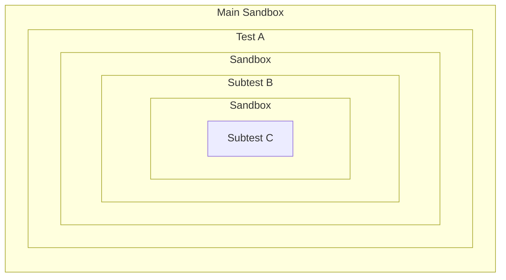
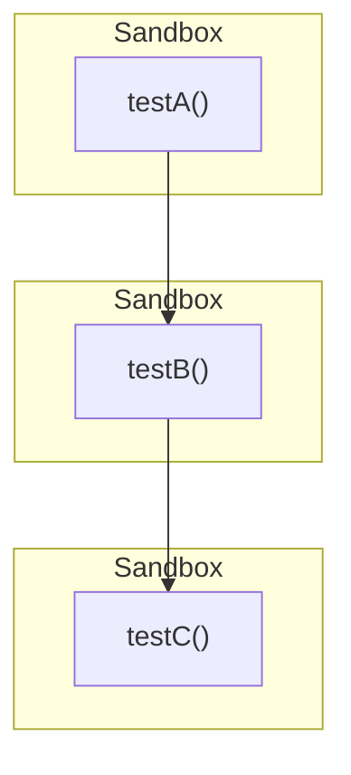

# Emergent Testing in JavaScript 

Have you ever wondered why modern testing frameworks are so complicated? And I'm not talking about features, but about how much you need to learn just to start writing tests. And there are also these platform dependency questions, like will it run my tests in a browser? How will it work? If we need to test in a new browser and the framework doesn't support it, do we need to rewrite everything?

While I was working on FunctionalScript (a purely functional subset of JavaScript), the problem became even bigger. Tests for FunctionalScript have to be written on FunctionalScript, but FunctionalScript doesn't allow importing non-FunctionalScript code. Of course, there were no test frameworks written on FunctionalScript at that time. So I had to write it myself. But I didn't want tests to depend even on my own framework.

## Conventions over API

*Note: the following conventions and test runner implementations are applied for any JavaScript modules (ECMAScript definition of a module), including TypeScript and FunctionalScript code.*

Most modern test frameworks force you to use their API to write tests, with functions such as `describe`, `test`, etc. I took a different approach: what if a test runner finds tests by name conventions?

My initial approach was to use a special file naming convention, but this opens another issue: If we copy the content of such a file (source code), then it's hard to distinguish whether the code is test code that we need to run or if it's just the source code of some module. Especially now, when we use AI agents to write code and copy/paste code between conversations. And limiting context can save tokens and money. The test runner no longer asks whether a file is a test. Instead, it asks whether a module contains a proof. This allows any JavaScript code to be self-descriptive and to answer the question of whether it has tests.

## What's a proof?

A proof is either a test case (a function with zero arguments), an array of proofs, or a map (a JavaScript object) of proofs. All other values are discarded. The test case throws an exception if it fails. Otherwise, it can return a new proof, which is processed recursively.

One more rule: if an object property has the `throw` name, then all proofs in the property value are expected to throw.

```ts
export const add = (a: number, b: number): number => a + b

export const mul = (a: number, b: number): number => a * b

export const sqr = (a: number) => mul(a, a)

export const todo = () => { throw "not implemented" }

const checkMul = (a: number, b: number, r: number) => {
    if (mul(a, b) !== r) { throw `mul(${a}, ${b}) !== ${r}` } 
}

export const proof = {
  addTest: () => {
    if (add(2, 2) !== 4) { throw "something wrong with the math" }
  },
  mulTest: [
    () => checkMul(2, 3, 6),
    () => checkMul(22, 34, 748),
    () => checkMul(-2, 3, -6),
    () => checkMul(-2, -3, 6),
  ],
  throw: {
     todo,
     divByZero: () => 5n / 0n,
  },
  emergentSqrTests: () => [1, 2, 3, 5].map(a => () => {
    if (sqr(a) !== a * a) { throw `sqr(${a})` }
  })
} 
```

## Emergence vs Orchestration

In traditional testing models, tests are orchestrated: a developer explicitly structures execution by calling a `test` function inside another test to define subtests and control the execution flow.

The runner must be capable of creating and managing new test sandboxes from within an already running test sandbox. Some test frameworks don’t support nested test execution. This makes orchestration even harder.

```ts
import test from 'node:test'

test('Test A', t => {
    t.test('Subtest B', t => {
        t.test('Subtest C', () => {
            // assertion
        })
    })
})
```



In case of emergent testing, each test case can return a new proof or a set of proofs. These new proofs are executed outside of the parent test sandbox. So we can dynamically generate new test cases, return them from the test case function, and have a test runner execute them in new, isolated sandboxes. Tests do not execute other tests. They only reveal them. 

```ts
export const proof = {
    testA: () => ({
        testB: () => ({
            testC: () => {
                // assertion
            },
        }),
    }),
}
```



Property-based testing is a related approach; it also generates cases dynamically but typically requires a dedicated eDSL. Emergence gets you dynamic generation with nothing but functions returning functions.

## Implementation

FunctionalScript has an implementation of an emergent test runner. It can also be used as an adapter for registering proofs for testing in Node.js, Deno, Bun, and Playwright. You can also build your own runner or adapter for other test frameworks.

For technical details and the precise execution rules, see: https://github.com/functionalscript/functionalscript/blob/main/fs/emergent_testing/README.md

## Why do I need to care if I can vibe-code the tests for any test framework?

That's right, you can. However, we should understand that any rewrite is always a risk, no matter how good the rewritter is. Tests that do not depend on a particular testing framework tend to survive longer and require less maintenance than tests that must be rewritten whenever tooling changes.

The second point is that it is still expensive, you need to burn more tokens, and increase the complexity of your prompts, and any additional complexity always increases the risk of an incorrect, low-quality solution.

## What's next?

I would like to investigate and learn how this idea can be applied to other programming languages. For scripting languages such as Python, the implementation could be straightforward. For languages with RTTI, such as C#, Java, the implementation could use RTTI to discover proofs. For other languages, like Rust, C++, some metaprogramming and code generation may be involved.

The subject is quite new, so feel free to share your opinion.

 
