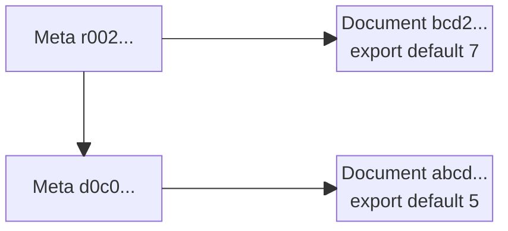
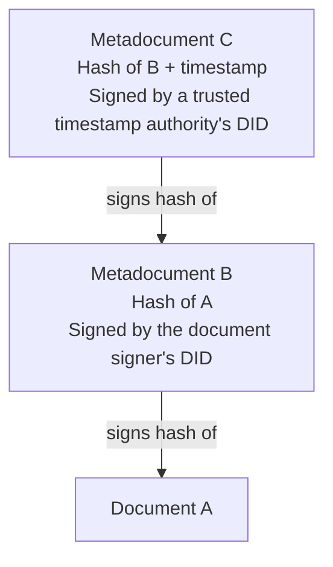
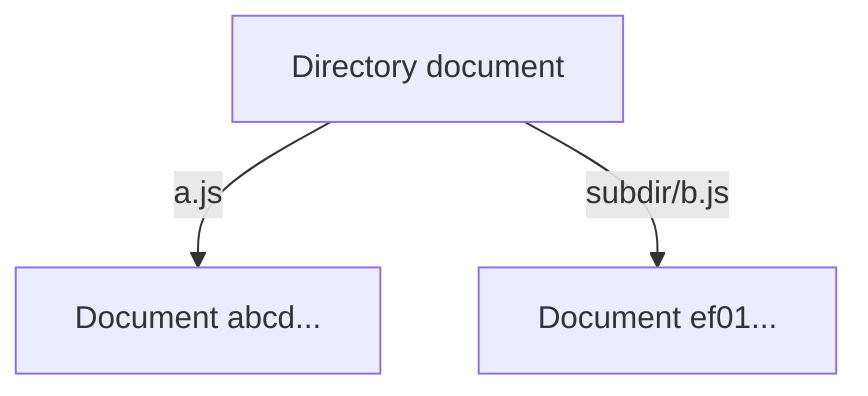

# DISOT

## Content Addressed By Hash

Using cryptographic hash functions to address any [document](./doc-def.md). The hash can be used as a universal address for an immutable sequence of bits (records, files, BLOBs). The hash function doesn't know (doesn't parse, understand) file sequence. It can generate a hash for any sequence.

## DAG

If we use the hashes as addresses, then we can references documents from other documents.

For example,

- Document `abcd...`

  ```js
  export default 5
  ```

- Document `ef01...`

  ```js
  import x from 'abcd...'
  export default x * 2
  ```

- Document `2345...`

  ```js
  import x from 'abcd...'
  import y from 'ef01...'
  export default x + y
  ```

A set of such documents creates an immutable graph:


Each link has a direction and such graphs can't have cycles. So it's called [Directed Acyclic Graph (DAG)](https://en.wikipedia.org/wiki/Directed_acyclic_graph). The links also show time order: a document `B` that reference a document `A` can't be created before the document `A`.

Document types could be different: text, code, HTML, images, video, etc.

## Meta Information

Often we need additional information about files. That may include, document type (e.g. `ContentType`), authors (e.g. digital signatures), licensing, version (e.g. Git commit as a document), time (e.g. trusted time-stamp), reference resolution snapshot (e.g. lock files such as `package-lock.json`, `Cargo.lock`).

### Document Evolution

If we mutate a document, then it will have a different hash. We can call such a document a new revision of the original document. The revision should point to the old version of a document, otherwise we will not know what's this document. Some document formats may support referencing to a previous revision. If not, we can use something like Git commit object:

```js
export default {
    document: $documentHash,
    parent: $parents,
    author: $author,
}
```

For example,

- Document, reversion # 1: `abcd...`

  ```js
  export default 5
  ```

- Document, revision # 2: `bcd2...`

  ```js
  export default 7
  ```

- Meta document for revision # 1: `d0c0...`

  ```js
  export default {
      document: "abcd...",
  }
  ```

- Meta document for revision # 1: `r002...`

  ```js
  export default {
      document: "bcd2...",
      parent: "r002...",
  }
  ```



### Authorship

We can use [Decentralized Identifier (DID)](https://en.wikipedia.org/wiki/Decentralized_identifier) and digital signatures to confirm document ownership, its author and other properties, such licensing and when the document was created using [Trusted Timestamping] (https://en.wikipedia.org/wiki/Trusted_timestamping).

Note, the sequence should like this:

1. A document `A`.
2. A metadocument `B` that signs the hash of the document `A`.
3. A metadocument `C` that signs the hash of the metadocument `B` and a timestamp using DID of a trusted timestamp authority.



This type of meta-information allow us to establish autorship of documents that cryptographically hard to fake.

We call it Decentralized Immutable Source Of Truth (DISOT), because it's cryptographically hard to alter such documents and disprove authorship.

Decentralized Trusted Timestamps:
- https://opentimestamps.org/
- https://stamp.gridcoin.club/about

Merkle Tree Signing:

- Root
  - $0
    - $00
      - $000
      - $001
    - $01
      - $010
      - $011
  - $1
    - $10
      - $100
      - $101
    - $11
      - $110
      - $111

Proof for $000: $00 = hash($000, $001), $0 = hash($00, $01), $root = hash($0, $1)

## Directories

A directory of files can be also be represented as a document. For example,

```js
export default {
    "a.js": "abcd...",
    "subdir/b.js": "ef01...",
}
```



## Relative Names

Relative names and Web Of Trust.

## Snapshot

## Git Projection

`.disot.json` for metainformation.
