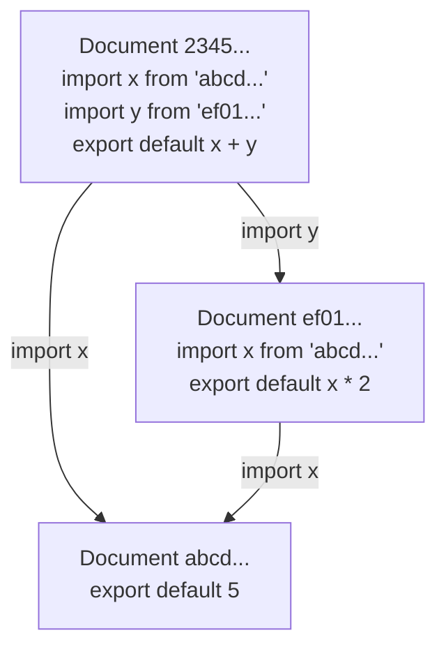
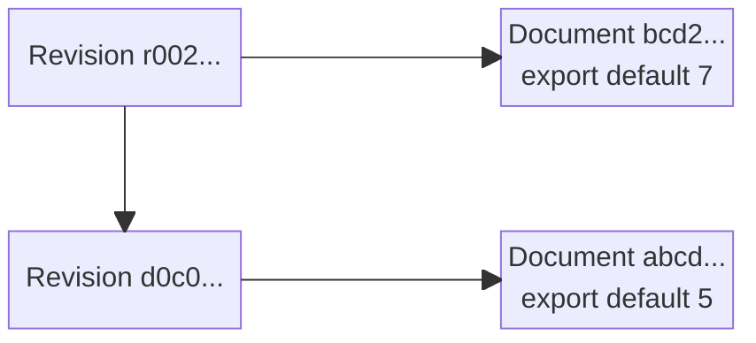
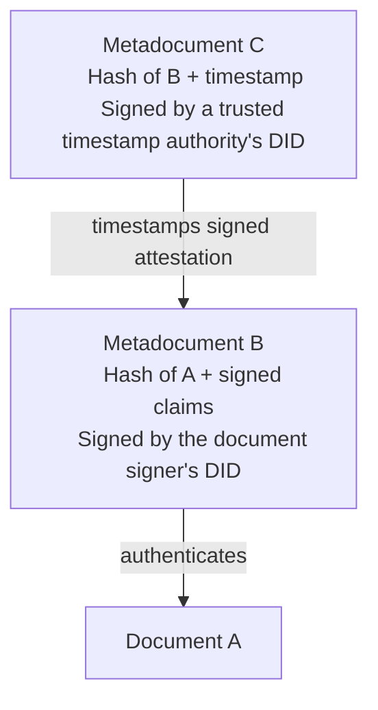
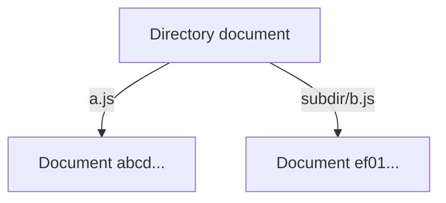

# DISOT

**Decentralized Immutable Source Of Truth (DISOT)** combines content-addressed
documents, immutable history, digital signatures, trusted timestamps, and a Web
of Trust. Content and evidence can be copied and verified without depending on
one server, hosting provider, or globally trusted authority.

This is an overview of the proposed model. Examples use abbreviated, illustrative
hashes and metadata shapes; the linked design TODOs define the protocol details.

## Content Addressed By Hash

A [digital document](./doc-def.md) is a complete, bounded unit of digital content,
represented by a finite sequence of bits. A file stores a document and associates
it with a filename and filesystem metadata; the document itself is independent
of that container.

A cryptographic hash addresses a document by its content. The hash function does
not need to parse or understand that content: text, code, images, audio, video,
and structured data can all be addressed in the same way.

An identifier includes the hash algorithm, for example `sha256:...` or
`sha512:...`. For one algorithm, the same document always has the same hash.
Different algorithms provide their respective identifiers for the same document;
changing its filename, URL, or storage location does not change its hash.
Distinct files, even in the same directory, can therefore contain the same
document. Collision resistance is a security assumption, not a claim that a
finite hash mathematically distinguishes every possible document.

Retrieval and identity are separate: a server, peer, local store, or offline copy
can supply the bits, and the recipient checks them against the requested hash.
An address does not by itself guarantee that somebody will retain those bits.

## DAG

Documents can reference other documents by hash. For example:

- Document `abcd...`:

  ```js
  export default 5
  ```

- Document `ef01...`:

  ```js
  import x from 'abcd...'
  export default x * 2
  ```

- Document `2345...`:

  ```js
  import x from 'abcd...'
  import y from 'ef01...'
  export default x + y
  ```



The construction rule is that a new document's content-addressed references
point to already constructed documents. Following these references produces a
**directed acyclic graph (DAG)**: arrows point from a document to its dependencies.
This rule concerns actual content-addressed references, not arbitrary text that
happens to resemble a hash or names whose resolution may change.

The links describe a causal partial order. They do not establish wall-clock
creation times or order documents that have no dependency relationship. Copying
or discovering a document later does not change that graph.

## Meta Information

A **metadocument** is a document that describes other documents by referencing
their hashes. It can describe a content type, an authorship claim, a license,
revision history, a trusted timestamp, or a reference-resolution snapshot.
It is not a special mutable attachment: it has its own content and hash.

Different metadocuments can describe the same document without changing it.
Additional signatures or timestamps can be published later as new metadocuments.
A claim becomes evidence to evaluate, not an automatically trusted fact merely
because it is stored in the graph.

### Document Evolution

Editing content creates a different document rather than changing an existing
content-addressed document in place. A revision metadocument connects the content
to its history. A metadata-only revision can also reuse the same content hash.

For example, the content of revision 1 is document `abcd...`:

```js
export default 5
```

The content of revision 2 is document `bcd2...`:

```js
export default 7
```

Revision metadocument `d0c0...` references the first document:

```js
export default {
    document: 'abcd...',
    parents: [],
}
```

Revision metadocument `r002...` references the second document and the previous
**revision metadocument**, not itself:

```js
export default {
    document: 'bcd2...',
    parents: ['d0c0...'],
}
```



The newer revision is above its parent; each revision points right to its
content. Multiple parent references can represent a merge. Independent revisions
of the same parent remain distinct documents: discovering one must not erase
the other. Selecting an authoritative head is a separate naming and trust
question, not a mutation of this history.

### Authorship And Trusted Timestamps

A [Decentralized Identifier (DID)](https://www.w3.org/TR/did-core/) identifies the
signer independently of the server carrying the document. A signed attestation
binds the document's algorithm-qualified hash and the claims being signed, such
as authorship or licensing, to the signer's verification method.

The order matters:

1. Create document `A`.
2. Create metadocument `B`, containing a DID signature that authenticates `A`
   and binds any accompanying claims.
3. Create metadocument `C`, authenticating the hash of **B** and a timestamp
   through a trusted timestamp authority. In the DID-native model, this
   attestation uses the authority's DID.



Timestamping `B`, rather than only `A`, provides evidence that the **signature
and its claims** already existed within the accepted time bound. It does not
establish the exact instant the document was created. An
[RFC 3161](https://www.rfc-editor.org/rfc/rfc3161.html) token uses a
certificate-based TSA signature; it is a separate evidence encoding, not
implicitly a DID signature. Verification must respect the provider's accuracy
and trust policy, including any uncertainty in the reported time.

A valid key signature, historical authorization of that key for a DID, and
trust in the signer's claims are separate checks. Key rotation must not make a
current DID document sufficient evidence of past key authorization. A signature
alone does not establish who originally created the content or whether a claim
is true.

DISOT makes content and attributed statements verifiable and tamper-evident
under the accepted cryptographic and trust assumptions. “Source Of Truth” does
not mean that every signed statement is true or that everyone must trust the
same signers. Shared authoritative history requires accepted authentication
and trusted timestamp evidence; local work can remain provisional beforehand.

Blockchain-based timestamping is another form of evidence to evaluate. The
[OpenTimestamps](https://opentimestamps.org/) and
[Gridcoin Stamp](https://stamp.gridcoin.club/about) references are starting
points for investigation, not a requirement to depend on either service.

### Merkle Tree Signing

A Merkle tree combines many hashes into one root that can be signed or
timestamped. For a binary tree with eight leaves, a proof for leaf `h000` needs
its sibling `h001`, then sibling subtree hashes `h01` and `h1`:

```text
h00  = node(h000, h001)
h0   = node(h00, h01)
root = node(h0, h1)
```

The verifier computes the leaf hash from the document and reconstructs the
root using those siblings in their recorded left/right positions. The format
must specify unambiguous encodings and distinguish leaf hashing from internal
node hashing; `node` above is conceptual, not a wire-format definition.

To timestamp many signatures, aggregate the signed metadocuments, not just the
unsigned content hashes. Retain each signed metadocument, its inclusion proof,
and the root's timestamp evidence. Inclusion under a signed root does not by
itself establish original authorship of every included document.

## Directories

A directory can itself be represented as a document mapping relative paths to
document hashes:

```js
export default {
    'a.js': 'abcd...',
    'subdir/b.js': 'ef01...',
}
```



These paths are names within this directory, not intrinsic properties of the
target documents. Several paths can reference the same document. Changing a
mapping creates a new directory document; the old directory remains addressable
by its hash.

## Global Names

A **global name** includes an explicit root: a cryptographic hash or a DID.
It does not depend on the reader's local names or require a base directory to
identify that root. Global naming is independent of storage and transport.

### Hash-Based Names

A hash-based global name, such as `sha256:...`, identifies one immutable
document under the hash algorithm's security assumptions. It includes both
the algorithm and its hash value. The same document has the same name for
that algorithm, regardless of who stores or retrieves it.

A directory document can itself be named by its hash, providing an immutable
base for the paths stored in that directory. Changing the directory's mappings
creates a different document with its own hash-based name.

### DID-Based Names

A DID, such as `did:example:alice`, globally identifies an identity rather than
one particular document revision. In DISOT, it can also serve as the root of a
namespace. For example, `/did:example:alice/parser` names `parser` within that
DID's namespace.

Unlike a hash-based name, a DID-based name can follow an evolving entity.
Accepted signed revisions can bind the same name to different document hashes
over time. The name does not itself pin the content: resolving it requires
the relevant history, authority, and trusted timestamp evidence. New revisions
do not rewrite earlier statements, and conflicting histories remain available
for inspection even when a resolver's policy selects one for use.

“Global” means that the root is explicit, not that everyone must trust its
controller or agree on the current revision. A global name is neither a promise
of availability nor a globally allocated human-readable spelling.

## Relative Names

A **relative name** omits the global root and is interpreted against a supplied
base: a directory, a namespace, or the reader's identity and trust relationships.
The same spelling can resolve differently with different bases. The base belongs
to the context in which a document is used; it is not necessarily intrinsic to
the document's bits.

With a hash-named directory as the base, `./a.js` uses that immutable directory's
`a.js` entry and yields the referenced document's hash-based global name.
With a DID namespace as the base, a relative name can instead expand to a
DID-based global name:

```text
base namespace = /did:example:alice/
relative name  = ./json
global name    = /did:example:alice/json
```

A personal Web of Trust supplies another context. In `~/alice/charlie/parser`,
`~` denotes the reader's identity root: `alice` is resolved from that root,
`charlie` through that Alice's relationships, and `parser` within the resulting
namespace. Another reader can associate `alice` with a different identity.
There is no requirement for one globally popular account to own the spelling.

Signed statements record names, relationships, and delegation. Each resolver
chooses which identities to trust for the relevant subject and operation;
validating a signature does not grant its signer authority over somebody
else's namespace. Trust is contextual, not a single global reputation score.

Resolving a relative name supplies its missing context. Resolving an evolving
DID-based name to a particular document is a separate step; a hash-based name
already identifies the selected content.

## Snapshot

A **snapshot** records the exact immutable resolutions used for a document's
references. A relative name may first expand to a DID-based global name and
then resolve to a hash-based global name. For example, with
`/did:example:alice/` as the base namespace:

```text
./json -> /did:example:alice/json -> sha256:...
```

Once an applicable lock pins a hash, later name or trust updates must not silently
replace that binding. Retaining the snapshot and its referenced documents makes
that resolution reproducible without depending on a live naming service.
Verification and authorization remain separate from the choice of a pinned hash.

Locks are scoped to their referring modules or documents. Two dependencies can
therefore use different revisions of a shared dependency; one global flat map
need not force them to agree. Updating a dependency creates a new snapshot or
revision metadocument, while the original source and its relative references
can remain unchanged. The exact lock representation belongs to the linked
naming and lock-map designs.

## Git Projection

Git is primarily useful to DISOT as an existing **document format and local-first
history model**, rather than as a protocol. A Git repository is a set of
content-addressed objects that can be copied and exchanged in many ways.

### Why Git

Git is already the most widely used decentralized version-control system, with a
large ecosystem of tools, services, and hosting. A repository is local: it can
be read, changed, branched, and merged without a server.

More importantly, Git already has most of the document model DISOT needs:

- **Documents:** blobs store arbitrary bytes.
- **Directories:** trees map names to blobs and other trees.
- **Revisions:** commits reference a tree and parent commits.
- **Merges:** a commit can have multiple parents.
- **Digital signatures:** Git commits and tags can already be signed.
- **Transport:** repositories can be copied between local storage and many hosts.

For example:

```text
commit r002 -> tree -> document bcd2...
|
v
commit d0c0 -> tree -> document abcd...
```

DISOT mainly adds what Git does not provide:

- **trusted timestamps**;
- **decentralized names** for evolving things, independent of Git branches and
  hosting providers;
- **lock/snapshot files** that resolve relative names to exact immutable hashes.

Git submodules already provide a limited example of the last idea: one repository
can pin another repository to an exact commit. DISOT generalizes this to names
and documents without requiring every dependency to be a Git repository.

The main compatibility disadvantage is hashing. Most existing Git hosting and
services still use SHA-1 object IDs. DISOT must therefore support existing Git
while also providing stronger hash identities and a migration path.

### Other Decentralized Systems

Git is not the only useful system. The differences are easiest to see by example:

- **IPFS:** `CID -> immutable document`. Excellent for content-addressed storage
  and distribution. IPNS adds a mutable signed pointer. Git adds the familiar
 