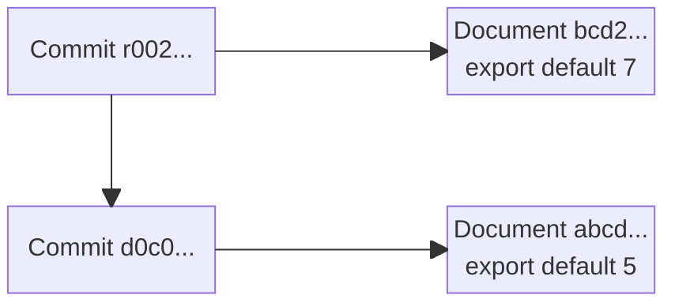

# DISOT

## Content Addressed By Hash

Using cryptographic hash functions to address any [document](./doc-def.md). The hash can be used as a universal address for an immutable sequence of bits (records, files, BLOBs). The hash function doesn't know (doesn't parse, understand) file sequence. It can generate a hash for any sequence.

## DAG

If we use the hashes as addresses, then we can references documents from other documents.

For example,

- Document `abcd...`

  ```js
  export default 5
  ```

- Document `ef01...`

  ```js
  import x from 'abcd...'
  export default x * 2
  ```

- Document `2345...`

  ```js
  import x from 'abcd...'
  import y from 'ef01...'
  export default x + y
  ```

A set of such documents creates an immutable graph:


Each link has a direction and such graphs can't have cycles. So it's called [Directed Acyclic Graph (DAG)](https://en.wikipedia.org/wiki/Directed_acyclic_graph).

Document types could be different: text, code, HTML, images, video, etc.

## Meta Information

Often we need additional information about files. That may include, document type (e.g. `ContentType`), authors (e.g. digital signatures), licensing, version (e.g. Git commit as a document), time (e.g. trusted time-stamp), reference resolution snapshot (e.g. lock files such as `package-lock.json`, `Cargo.lock`).

### File Evolution

If we mutate a document, then it will have a different hash. We can call such a document a new revision of the original document. The revision should point to the old version of a document, otherwise we will not know what's this document. Some document formats may support referencing to a previous revision. If not, we can use something like Git commit object.

```js
export default {
    document: $documentHash,
    parent: $parents,
    author: $author,
}
```

For example,

- Document, reversion # 1: `abcd...`

  ```js
  export default 5
  ```

- Document, revision # 2: `bcd2...`

  ```js
  export default 7
  ```

- Commit document for revision # 1: `d0c0...`

  ```js
  export default {
      document: "abcd...",
  }
  ```

- Commit document for revision # 1: `r002...`

  ```js
  export default {
      document: "bcd2...",
      parent: "r002...",
  }
  ```


