# DISOT

**Decentralized Immutable Source Of Truth**

```text
immutable documents
       +
immutable history
       +
signatures + trusted time
       +
decentralized names
       =
      DISOT
```

## Documents

A [document](./doc-def.md) is a finite sequence of bits. A hash is its immutable global name.


The same document may have different filenames, URLs, or storage locations. Its content stays the same.

Documents can reference other documents by hash:

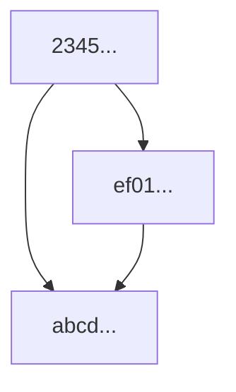

This creates an immutable DAG.

## History Without Mutation

Changing a document creates a new document. A metadocument connects revisions:

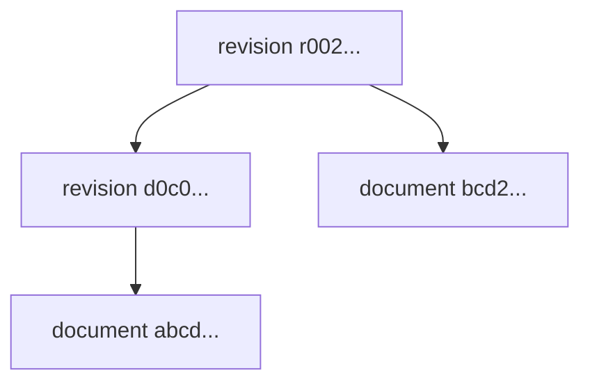

```js
// r002...
export default {
    document: 'bcd2...',
    parents: ['d0c0...'],
}
```

Nothing is overwritten. Multiple parents represent a merge; multiple children represent forks.

## Authorship + Trusted Time

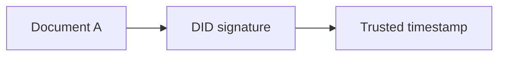

The timestamp covers the signed statement, not only the unsigned document:

```text
A = document
B = signature(hash(A), author DID)
C = trusted timestamp(hash(B))
```

Merkle trees can batch many signed documents under one trusted timestamp.

## Directories Are Documents

```js
export default {
    'a.js': 'abcd...',
    'subdir/b.js': 'ef01...',
}
```

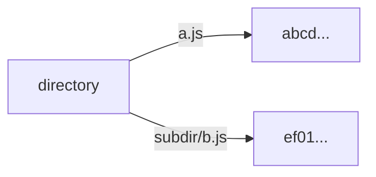

Changing one path creates a new directory document. The old directory still exists.

## Global Names

### Immutable hash name

```text
sha256:abcd...
```

It identifies exactly one document.

### Evolving DID name

```text
/did:example:alice/parser
```

The name can evolve, but **the name history is immutable**:

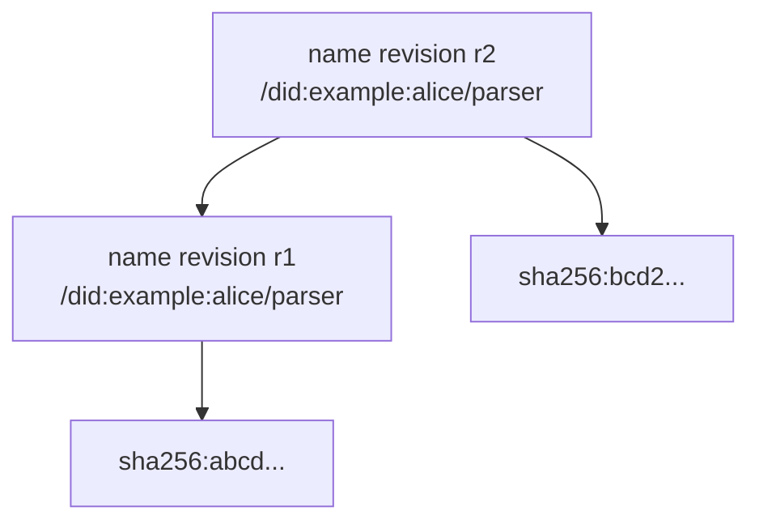

A name is not a mutable pointer. Renames, transfers, forks, and conflicting updates remain visible in history.

## Relative Names

```text
base          = /did:example:alice/
relative name = ./json
result        = /did:example:alice/json
```

A Web of Trust can provide the context:

```text
~/alice/charlie/parser
```

`~` is the reader's root. Another reader may resolve `alice` differently.

Relative-name mappings also evolve through immutable revisions.

## Snapshots

Names evolve. Hashes do not.


A snapshot locks the resolution. Later name revisions do not change the dependency.

Git submodules already demonstrate a limited version of this idea: one repository pins another to an exact commit. DISOT generalizes it to arbitrary documents and names.

# Why Git?

Git is already a very popular **decentralized, local-first document format and history model** with a huge ecosystem of tools, services, and hosting.

More importantly, a Git repository is portable history.

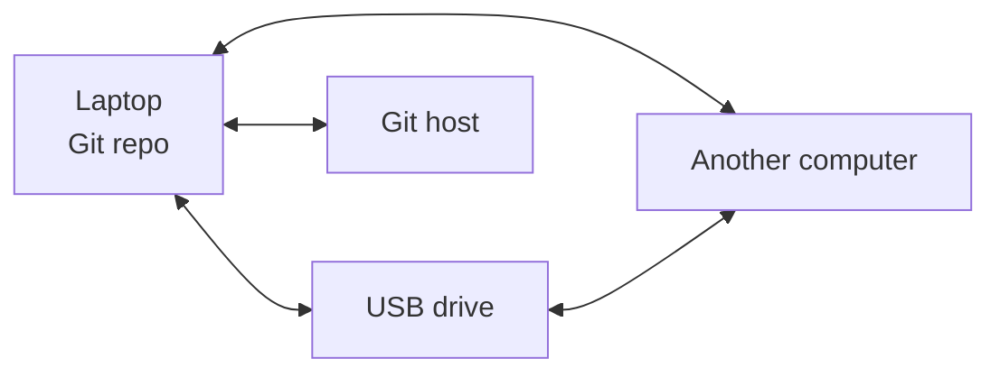

You can copy a repository, put it on a USB drive, send it over a network, restore it years later, or synchronize copies through completely different transports.

The history does not depend on the transport.

## Sneakernet Is A Feature

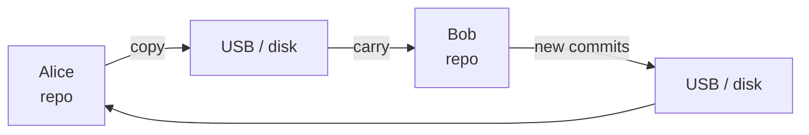

No server is required. No Internet is required. The same repository can later synchronize through SSH, HTTPS, a hosting provider, local filesystem copies, removable media, or another future transport.

That property fits DISOT well: **documents and history should survive services and protocols**.

## Git Already Has Most Of The Format

```text
Git                 DISOT
--------------------------------------
blob             -> document
tree             -> directory
commit           -> revision metadocument
parent           -> previous revision
multiple parents -> merge
gpgsig           -> digital signature
```

Example:

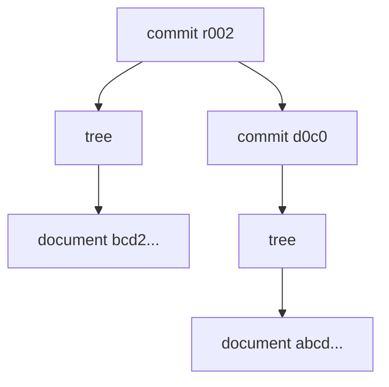

## What DISOT Adds To Git

```text
Git already has                 DISOT adds
-------------------------------------------------------
content-addressed objects       trusted timestamps
revision DAG                    decentralized names
merges                          immutable name history
digital signatures             locks / snapshots
local repositories              Web of Trust resolution
```

For a Git-backed entity:

```json
{
  "dialect": "vnd.fjs.disot",
  "name": "/did:example:alice/parser"
}
```

Embedded evidence can add trusted time while remaining a Git commit:

```text
A = unsigned commit
B = A + vnd.fjs.didsig
C = B + vnd.fjs.ttssig
D = C + optional normal Git signature
```

## Branches Are Not Names

A Git branch is a mutable ref:

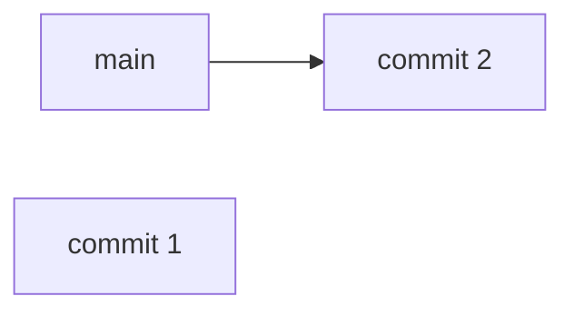

After an update:

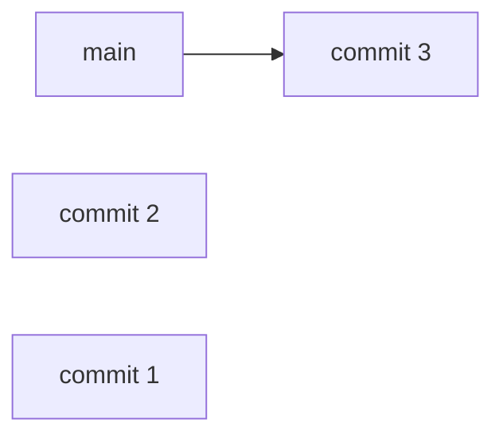

The commits may remain, but the branch itself does not contain immutable history of its changes.

DISOT names do:

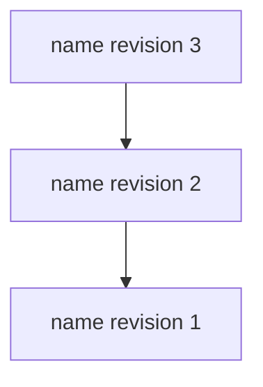

So Git branches are useful for workflow and for keeping objects reachable, but they are not DISOT global or relative names.

## Git's Main Disadvantage: SHA-1

Most existing Git services still use SHA-1 object IDs.

```text
existing Git SHA-1 identity
          +
stronger DISOT hash identity
          +
migration mapping
```

DISOT should preserve compatibility with today's Git ecosystem without making SHA-1 its permanent trust foundation.

# Other Decentralized Systems

They can complement Git rather than compete with it.

## IPFS / IPNS

```text
IPFS: CID -> immutable content
IPNS: name -> current CID
```

IPFS fits DISOT naturally as a content distribution/storage layer.

IPNS is different from DISOT naming because an IPNS name is a mutable current pointer:

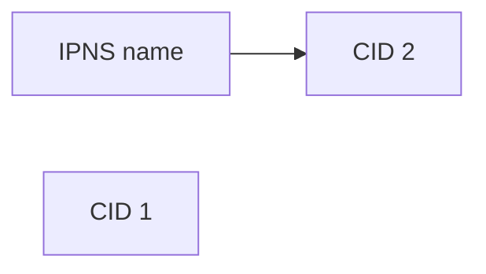

DISOT keeps the name changes themselves as immutable history:

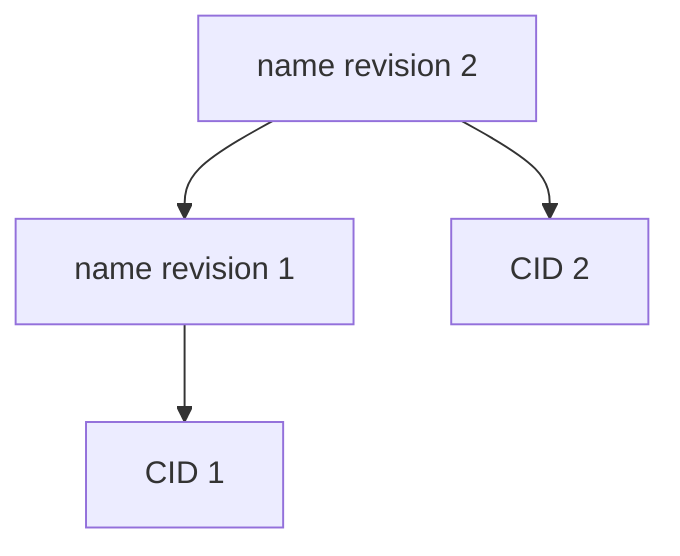

## Nostr

```text
public key -> signed events -> relays
```

Nostr is useful for identity, discovery, signed communication, and decentralized distribution. [NIP-34](https://github.com/nostr-protocol/nips/blob/master/34.md) already demonstrates Git collaboration over Nostr.

A possible combination:

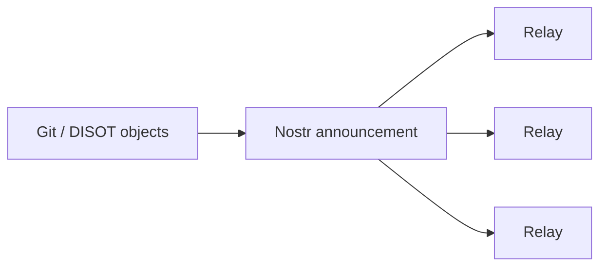

## AT Protocol

```text
DID -> signed content-addressed repository
```

AT Protocol already has useful ideas around DID identity, signed repositories, and federation. Its data model is oriented around structured account records; Git gives DISOT a general local directory and revision model.

# One History, Many Transports

The important property is not Git hosting. It is that the same immutable history can move between systems.

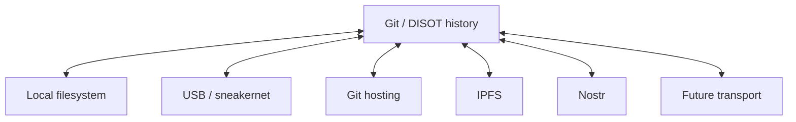

Backup, restore, and synchronization should not require the service that originally stored the data.

**The transport can change. The documents, signatures, names, and history remain verifiable.**

## Related Work

- [Git name resolution](../git-name-resolution.md)
- [Git trusted timestamp signatures](../git-trusted-timestamp-signatures.md)
- [DISOT CLI epic](../../fjs/todo/disot-cli-epic.md)
- [Git SHA-1 collisions](../git-sha1-collisions.md)
