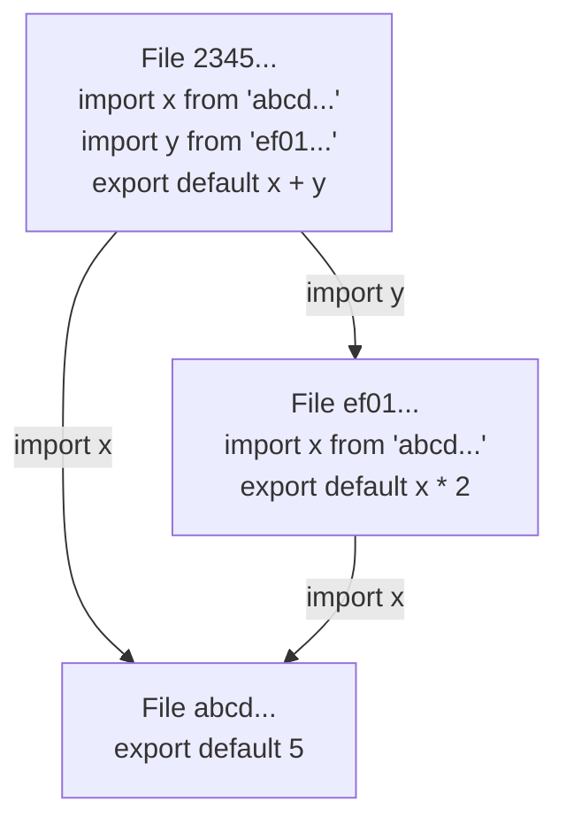

# DISOT

## Content Addressed By Hash

Using cryptographic hash functions to address any finite sequence of bits. The hash can be used as a universal address for an immutable sequence of bits (records, files, BLOBs). The hash function doesn't know (doesn't parse, understand) file sequence. It can generate a hash for any sequence.

## DAG

If we use the hashes as addresses, then we can references documents from other documents.

For example,

- File `abcd...`

  ```js
  export default 5
  ```

- File `ef01...`

  ```js
  import x from 'abcd...'
  export default x * 2
  ```

- File `2345...`

  ```js
  import x from 'abcd...'
  import y from 'ef01...'
  export default x + y
  ```

A set of such files creates an immutable graph:



Each link has a direction and such graphs can't have cycles. So it's called [Directed Acyclic Graph (DAG)](https://en.wikipedia.org/wiki/Directed_acyclic_graph).

## File Evolution

If we mutate a file, then it will have a different hash. We can call such a file a new revision of the old one.
And the revision should point to the old version of a file, otherwise we will not know what's this file. Some file formats may support  referencing to a previous revision. If not, we can use something like Git commit object.

