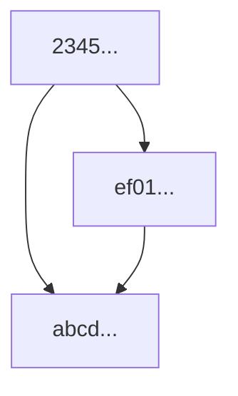
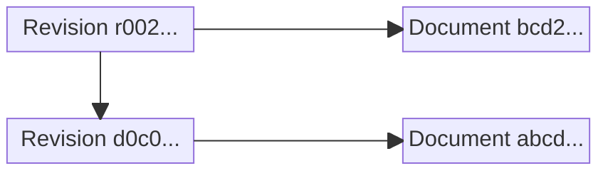
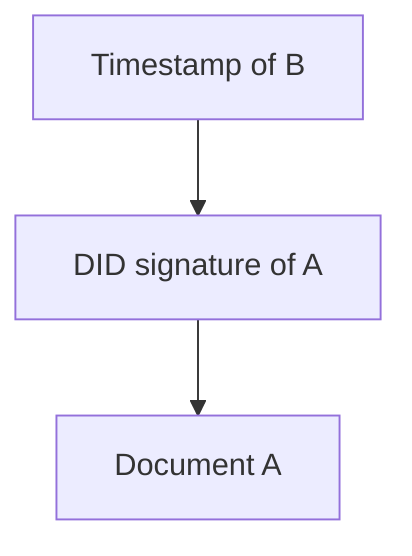

# DISOT

**Decentralized Immutable Source Of Truth (DISOT)** combines content-addressed documents, immutable history, digital signatures, trusted timestamps, decentralized names, and a Web of Trust.

## Documents And Hashes

A [digital document](./doc-def.md) is a finite sequence of bits with clear boundaries. A file is a container for a document; filenames, URLs, authorship, and timestamps are not part of the document itself.

A cryptographic hash gives an immutable global name to a document:

```text
sha256:...
sha512:...
```

For one hash algorithm, the same document always has the same hash. Different algorithms give the same document different global names.

Documents can reference other documents by hash:



If references point only to already-created documents, they form a DAG. The arrows provide causal order, not wall-clock time.

## Metadocuments

A **metadocument** is a document that describes another document by hash. It can add authorship, licensing, revision history, a trusted timestamp, or a snapshot without changing the original document.

### Revisions

Editing a document creates a new document with a new hash. A revision metadocument connects it to previous revisions.

```js
// d0c0...
export default {
    document: 'abcd...',
    parents: [],
}
```

```js
// r002...
export default {
    document: 'bcd2...',
    parents: ['d0c0...'],
}
```



Multiple parents represent a merge. Independent children of the same revision remain independent histories until something merges or selects them.

### Authorship And Trusted Timestamps

A DID signature can authenticate a document or metadocument. A trusted timestamp should timestamp the signed statement, not only the unsigned document:

1. Document `A`.
2. Metadocument `B` signs the hash of `A` using the author's DID.
3. Metadocument `C` timestamps the hash of `B` using a trusted timestamp authority.



This proves that the signed statement existed no later than the accepted timestamp bound. Signature validity, historical authorization of the key for the DID, and trust in the signer are separate questions.

Merkle trees can batch many signed metadocuments under one timestamp. An inclusion proof needs only the sibling hashes required to reconstruct the timestamped root.

## Directories

A directory is also a document:

```js
export default {
    'a.js': 'abcd...',
    'subdir/b.js': 'ef01...',
}
```

The paths are local names. Two paths may point to the same document. Changing a mapping creates a new directory document with a new hash.

## Global Names

A **global name** has an explicit root. DISOT has two important kinds.

### Hash Names

A hash names one immutable document:

```text
sha256:abcd...
```

No authority is needed to resolve it: retrieve some bytes and verify the hash.

### DID Names

A DID can root a namespace for evolving things:

```text
/did:example:alice/parser
```

Unlike a hash, this name can resolve to different document hashes over time. But the name itself is **not a mutable pointer**. Every change is a new signed immutable revision that references its previous revision, so the history of the name is preserved:

```text
name revision r2 -> sha256:bcd2...
|
v
name revision r1 -> sha256:abcd...
```

This is important for renames, ownership changes, forks, and conflicting updates: old states are not overwritten. Resolution means selecting a revision from immutable history using signatures, timestamps, and trust rules.

“Global” means the root is explicit. It does not mean everyone must trust the same DID or agree about an authoritative revision.

## Relative Names

A relative name omits the global root and uses a context.

For example:

```text
base          = /did:example:alice/
relative name = ./json
result        = /did:example:alice/json
```

A personal Web of Trust can provide the context:

```text
~/alice/charlie/parser
```

Here `~` is the reader's root. Another reader may resolve `alice` differently. This avoids requiring one globally allocated human-readable namespace.

Relative-name mappings follow the same rule as global DID names: changing a mapping creates a new immutable revision instead of overwriting the old mapping.

## Snapshot

Evolving names are convenient; immutable hashes are reproducible. A snapshot connects them:

```text
./json -> /did:example:alice/json -> sha256:abcd...
```

Once locked, later revisions of the DID name do not change this dependency. Locks can be scoped, so different modules may intentionally use different revisions of the same dependency.

## Git Projection

Git is a useful first representation of DISOT because it is already a very popular **decentralized, local-first document format** with a large ecosystem of tools, services, and hosting. Git transport protocols are useful, but DISOT primarily depends on the object format and history model, not on a particular transport or host.

### What Git Already Has

Git already represents most of the model:

```text
blob   = document
tree   = directory
commit = revision metadocument
parent = previous revision
```

A commit can have multiple parents, so merges are part of the format. Repositories are local and can be copied between hosts. Git also already supports digital signatures on commits and tags.

For example:

```text
commit r002 -> tree -> document bcd2...
|
v
commit d0c0 -> tree -> document abcd...
```

### What DISOT Adds

The main missing pieces are:

- **trusted timestamps** — Git's author and committer times are assertions, not trusted timestamps;
- **decentralized names** — names such as `/did:example:alice/parser` should have immutable revision history and not depend on a Git branch, DNS name, or hosting provider;
- **locks/snapshots** — relative and evolving names should resolve reproducibly to exact hashes.

Git submodules are already a limited example of the last idea: one repository pins another repository to an exact commit. DISOT generalizes this from repositories to arbitrary named documents and dependencies.

For Git-backed entities, `.disot.json` can carry the DISOT metadata:

```json
{
  "dialect": "vnd.fjs.disot",
  "name": "/did:example:alice/parser"
}
```

Git branches are mutable refs: moving a branch replaces the commit it currently points to. The old commits may still exist, but the branch itself does not contain an immutable history of its own changes. Therefore branches are useful for workflow and retention, but they are not DISOT global or relative names.

Embedded evidence can extend a Git commit with DID signatures and trusted timestamps:

```text
A = unsigned commit
B = A + vnd.fjs.didsig
C = B + vnd.fjs.ttssig
D = C + optional normal Git signature
```

### Disadvantage: SHA-1

The biggest compatibility problem is that most existing Git services still use SHA-1 object IDs. DISOT should remain compatible with existing Git repositories while also supporting stronger hash identities and migration to newer algorithms.

### IPFS, Nostr, And AT Protocol

They solve related problems and can complement Git:

```text
IPFS:       CID -> immutable content
Nostr:      public key -> signed events
AT Protocol: DID -> signed record repository
Git:        commit -> directory snapshot + parent history
```

**IPFS** is especially useful for content-addressed storage and distribution. IPNS adds a signed name that can be updated to point to new content. Like a Git branch, that is a mutable current pointer rather than an immutable revision history of the name itself. DISOT can use IPFS for immutable content, but would represent name changes as immutable revisions instead of using IPNS as its naming model.

**Nostr** already supplies public-key identities, signed events, and decentralized relay distribution. [NIP-34](https://github.com/nostr-protocol/nips/blob/master/34.md) even uses Nostr for Git collaboration. It can be useful for discovery and communication around DISOT objects.

**AT Protocol** has DID identities and signed content-addressed repositories. It is oriented around structured records and federated account repositories rather than Git's general local directory/revision model.

The goal is not to replace these systems. Git is the first projection because much of the required document model and ecosystem already exists; other systems can provide additional storage, discovery, identity, social, and transport layers.

### Related Work

- [Git name resolution](../git-name-resolution.md)
- [Git trusted timestamp signatures](../git-trusted-timestamp-signatures.md)
- [DISOT CLI epic](../../fjs/todo/disot-cli-epic.md)
- [Git SHA-1 collisions](../git-sha1-collisions.md)
