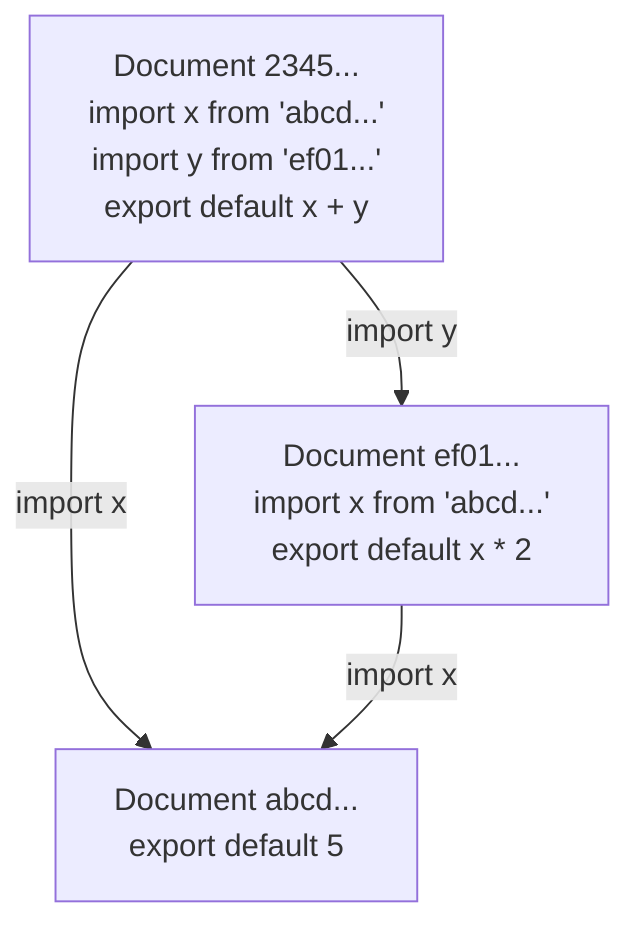
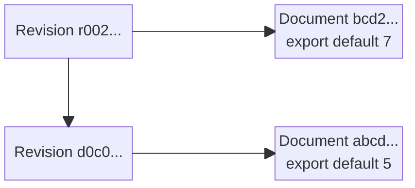
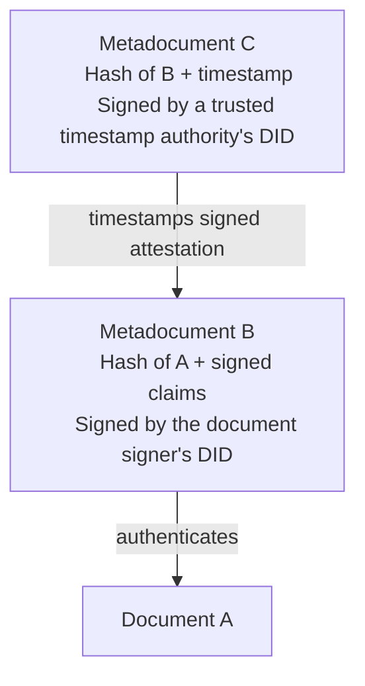
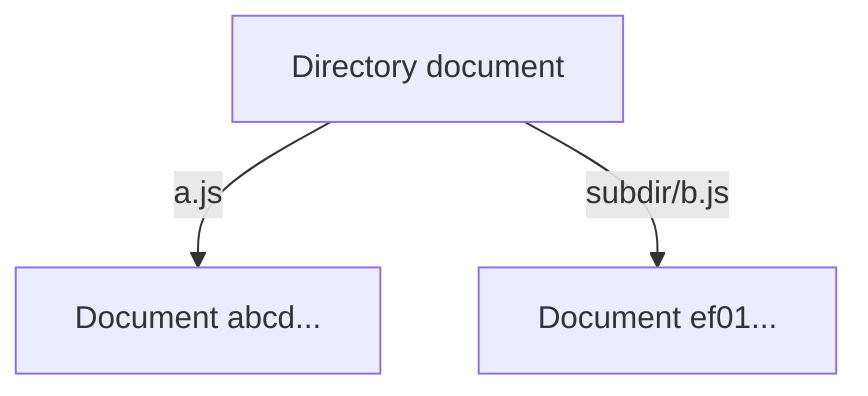

# DISOT

**Decentralized Immutable Source Of Truth (DISOT)** combines content-addressed
documents, immutable history, digital signatures, trusted timestamps, and a Web
of Trust. Content and evidence can be copied and verified without depending on
one server, hosting provider, or globally trusted authority.

This is an overview of the proposed model. Examples use abbreviated, illustrative
hashes and metadata shapes; the linked design TODOs define the protocol details.

## Content Addressed By Hash

A [digital document](./doc-def.md) is a complete, bounded unit of digital content,
represented by a finite sequence of bits. A file stores a document and associates
it with a filename and filesystem metadata; the document itself is independent
of that container.

A cryptographic hash addresses a document by its content. The hash function does
not need to parse or understand that content: text, code, images, audio, video,
and structured data can all be addressed in the same way.

An identifier includes the hash algorithm, for example `sha256:...` or
`sha512:...`. For one algorithm, the same document always has the same hash.
Different algorithms provide their respective identifiers for the same document;
changing its filename, URL, or storage location does not change its hash.
Distinct files, even in the same directory, can therefore contain the same
document. Collision resistance is a security assumption, not a claim that a
finite hash mathematically distinguishes every possible document.

Retrieval and identity are separate: a server, peer, local store, or offline copy
can supply the bits, and the recipient checks them against the requested hash.
An address does not by itself guarantee that somebody will retain those bits.

## DAG

Documents can reference other documents by hash. For example:

- Document `abcd...`:

  ```js
  export default 5
  ```

- Document `ef01...`:

  ```js
  import x from 'abcd...'
  export default x * 2
  ```

- Document `2345...`:

  ```js
  import x from 'abcd...'
  import y from 'ef01...'
  export default x + y
  ```



The construction rule is that a new document's content-addressed references
point to already constructed documents. Following these references produces a
**directed acyclic graph (DAG)**: arrows point from a document to its dependencies.
This rule concerns actual content-addressed references, not arbitrary text that
happens to resemble a hash or names whose resolution may change.

The links describe a causal partial order. They do not establish wall-clock
creation times or order documents that have no dependency relationship. Copying
or discovering a document later does not change that graph.

## Meta Information

A **metadocument** is a document that describes other documents by referencing
their hashes. It can describe a content type, an authorship claim, a license,
revision history, a trusted timestamp, or a reference-resolution snapshot.
It is not a special mutable attachment: it has its own content and hash.

Different metadocuments can describe the same document without changing it.
Additional signatures or timestamps can be published later as new metadocuments.
A claim becomes evidence to evaluate, not an automatically trusted fact merely
because it is stored in the graph.

### Document Evolution

Editing content creates a different document rather than changing an existing
content-addressed document in place. A revision metadocument connects the content
to its history. A metadata-only revision can also reuse the same content hash.

For example, the content of revision 1 is document `abcd...`:

```js
export default 5
```

The content of revision 2 is document `bcd2...`:

```js
export default 7
```

Revision metadocument `d0c0...` references the first document:

```js
export default {
    document: 'abcd...',
    parents: [],
}
```

Revision metadocument `r002...` references the second document and the previous
**revision metadocument**, not itself:

```js
export default {
    document: 'bcd2...',
    parents: ['d0c0...'],
}
```



The newer revision is above its parent; each revision points right to its
content. Multiple parent references can represent a merge. Independent revisions
of the same parent remain distinct documents: discovering one must not erase
the other. Selecting an authoritative head is a separate naming and trust
question, not a mutation of this history.

### Authorship And Trusted Timestamps

A [Decentralized Identifier (DID)](https://www.w3.org/TR/did-core/) identifies the
signer independently of the server carrying the document. A signed attestation
binds the document's algorithm-qualified hash and the claims being signed, such
as authorship or licensing, to the signer's verification method.

The order matters:

1. Create document `A`.
2. Create metadocument `B`, containing a DID signature that authenticates `A`
   and binds any accompanying claims.
3. Create metadocument `C`, authenticating the hash of **B** and a timestamp
   through a trusted timestamp authority. In the DID-native model, this
   attestation uses the authority's DID.



Timestamping `B`, rather than only `A`, provides evidence that the **signature
and its claims** already existed within the accepted time bound. It does not
establish the exact instant the document was created. An
[RFC 3161](https://www.rfc-editor.org/rfc/rfc3161.html) token uses a
certificate-based TSA signature; it is a separate evidence encoding, not
implicitly a DID signature. Verification must respect the provider's accuracy
and trust policy, including any uncertainty in the reported time.

A valid key signature, historical authorization of that key for a DID, and
trust in the signer's claims are separate checks. Key rotation must not make a
current DID document sufficient evidence of past key authorization. A signature
alone does not establish who originally created the content or whether a claim
is true.

DISOT makes content and attributed statements verifiable and tamper-evident
under the accepted cryptographic and trust assumptions. “Source Of Truth” does
not mean that every signed statement is true or that everyone must trust the
same signers. Shared authoritative history requires accepted authentication
and trusted timestamp evidence; local work can remain provisional beforehand.

Blockchain-based timestamping is another form of evidence to evaluate. The
[OpenTimestamps](https://opentimestamps.org/) and
[Gridcoin Stamp](https://stamp.gridcoin.club/about) references are starting
points for investigation, not a requirement to depend on either service.

### Merkle Tree Signing

A Merkle tree combines many hashes into one root that can be signed or
timestamped. For a binary tree with eight leaves, a proof for leaf `h000` needs
its sibling `h001`, then sibling subtree hashes `h01` and `h1`:

```text
h00  = node(h000, h001)
h0   = node(h00, h01)
root = node(h0, h1)
```

The verifier computes the leaf hash from the document and reconstructs the
root using those siblings in their recorded left/right positions. The format
must specify unambiguous encodings and distinguish leaf hashing from internal
node hashing; `node` above is conceptual, not a wire-format definition.

To timestamp many signatures, aggregate the signed metadocuments, not just the
unsigned content hashes. Retain each signed metadocument, its inclusion proof,
and the root's timestamp evidence. Inclusion under a signed root does not by
itself establish original authorship of every included document.

## Directories

A directory can itself be represented as a document mapping relative paths to
document hashes:

```js
export default {
    'a.js': 'abcd...',
    'subdir/b.js': 'ef01...',
}
```



These paths are names within this directory, not intrinsic properties of the
target documents. Several paths can reference the same document. Changing a
mapping creates a new directory document; the old directory remains addressable
by its hash.

## Relative Names

Hashes identify immutable documents. Human-readable names let people discover
and follow evolving entities without a global DNS-style registrar.

A name can be rooted in a DID, such as `/did:example:alice/parser`, or reached
through a personal Web of Trust, such as `~/alice/charlie/parser`. Here `~` is
the reader's identity root; each relationship is resolved in that context.
Another reader can associate `alice` with a different identity. There is no
requirement for one globally popular account to own the spelling.

Signed statements record names, relationships, and delegation. Each resolver
chooses which identities to trust for the relevant subject and operation;
validating a signature does not grant its signer authority over somebody
else's namespace. Trust is contextual, not a single global reputation score.

New signed revisions can change a name's resolution without rewriting earlier
statements. Conflicting histories remain available for inspection, even when
a resolver's policy selects one for use. For Git-backed entities, signed
directories help with trust-path traversal and discovery; they do not override
the authoritative history described in [Git Projection](#git-projection).

## Snapshot

A **snapshot** records the exact immutable resolutions used for a document's
references. It separates a human-readable dependency name from the revision
chosen for a particular use:

```text
./json -> /did:example:alice/json -> sha256:...
```

Once an applicable lock pins a hash, later name or trust updates must not silently
replace that binding. Retaining the snapshot and its referenced documents makes
that resolution reproducible without depending on a live naming service.
Verification and authorization remain separate from the choice of a pinned hash.

Locks are scoped to their referring modules or documents. Two dependencies can
therefore use different revisions of a shared dependency; one global flat map
need not force them to agree. Updating a dependency creates a new snapshot or
revision metadocument, while the original source and its relative references
can remain unchanged. The exact lock representation belongs to the linked
naming and lock-map designs.

## Git Projection

Git is an initial history, storage, and transport projection of this model, not
the definition of a document's identity or the only possible protocol.

Keep semantic metadata in a root `.disot.json`, with `.disot.data.js` as the
planned alternative encoding of the same logical value:

```json
{
  "dialect": "vnd.fjs.disot",
  "name": "/did:example:alice/parser"
}
```

Only metadata at the commit-tree root has this role. Multiple recognized root
encodings are an ambiguity to reject; nested files with those names are ordinary
content. The current proposal uses one string-valued `name`, with optional
scoped locks. Multiple self-names remain deferred.

Prefer an absolute DID-qualified name. A relative self-name such as `./parser`
requires one unambiguous authenticated author DID when established; it is
discouraged for shared or transferable entities. Later endorsers do not change
that name's base.

The presence of `.disot.json` does not establish authority. Accept a shared
revision only with the required authority and timestamp evidence, evaluated
with its ancestry. Evidence may be embedded or detached; a later attestation
can authenticate the exact existing revision without rewriting it.

For embedded evidence, the Git timestamp proposal defines this order:

```text
A = unsigned commit payload
B = A + vnd.fjs.didsig signatures over A
C = B + vnd.fjs.ttssig timestamp tokens over B
D = C + optional conventional Git signature over C
```

`didsig` is DID-native and algorithm-neutral, not an OpenPGP-only format.
`tts` means **Trusted Time-Stamp**. Multiple DID signatures cover the same `A`;
multiple TSA tokens cover the same frozen `B`. The optional conventional Git
signature is added last. These are precisely defined payload projections, not
signatures over the final Git object hash; use the companion specification
rather than inventing a different stripping or serialization rule.

Transporting an exact Git commit preserves its headers. Operations that create
new commits must not assume old custom headers or signatures are preserved or
remain valid. Naming metadata therefore belongs in the tree, not a custom
naming header.

Git branch names are only retention anchors that keep commits reachable for
garbage collection. They do not establish DISOT names, ownership, authority, or
which semantic head is current. An authorized and sufficiently timestamped
removal of root metadata relinquishes the inherited name only on the affected
ancestry; it neither deletes history nor archives incomparable forks. The
archive-retention representation remains an open question; this overview adds
no archival marker or protocol field.

Compatibility with ordinary Git and hosts such as GitHub, GitLab, and Radicle
is a goal to test, not a reason to make DISOT depend on a host's naming or hash
choices. Hash-algorithm migration and SHA-1 collision handling remain separate
tracked work.

The companion designs own the detailed formats and remaining implementation
decisions:

- [Git name resolution](../git-name-resolution.md) — authority, root metadata,
  locks, conflicts, and ancestry-scoped archival.
- [Git trusted timestamp signatures](../git-trusted-timestamp-signatures.md) —
  exact payload projections, DID evidence, and RFC 3161 verification.
- [DISOT CLI epic](../../fjs/todo/disot-cli-epic.md) — metadata editing, signing,
  timestamping, and verification commands.
- [Git SHA-1 collisions](../git-sha1-collisions.md) — hash-strength and
  compatibility questions.
