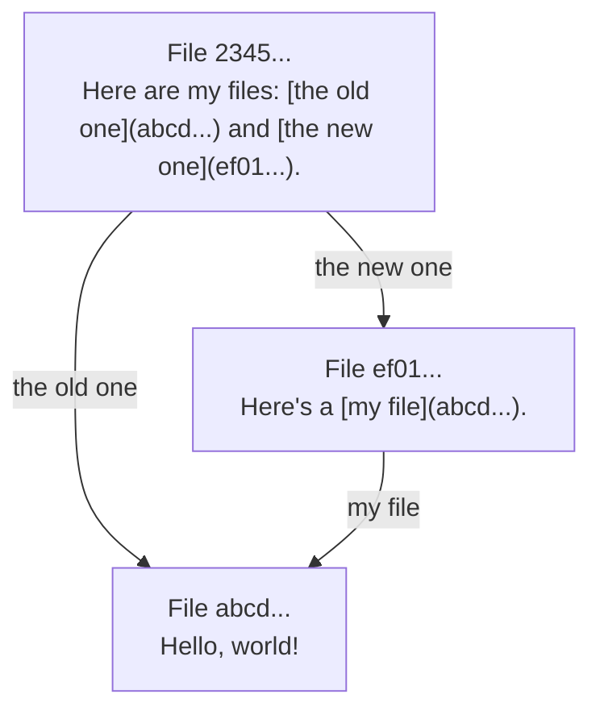

# DISOT

## Content Addressed By Hash

Using cryptographic hash functions to address any finite sequence of bits. The hash can be used as a universal address for an immutable sequence of bits (records, files, BLOBs). The hash function doesn't know (doesn't parse, understand) file sequence. It can generate a hash for any sequence.

## DAG

If we use the hashes as addresses, then we can references files from other files.

For example,

- File `abcd...`

  ```md
  Hello, world!
  ```

- File `ef01...`

  ```md
  Here's a [my file](abcd...).
  ```

- File `2345...`

  ```md
  Here are my files: [the old one](abcd...) and [the new one](ef01...).
  ```

A set of such files creates an immutable graph:



One note, such graphs can't have cycles.
