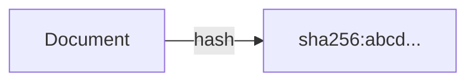
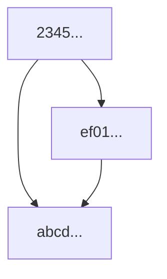
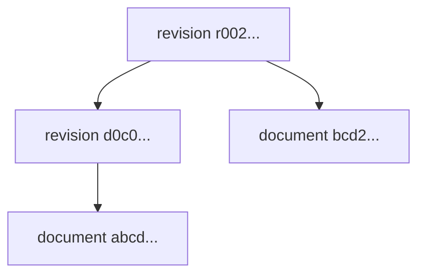
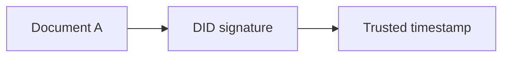
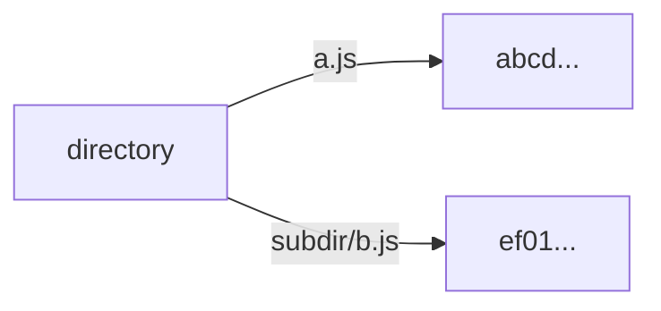
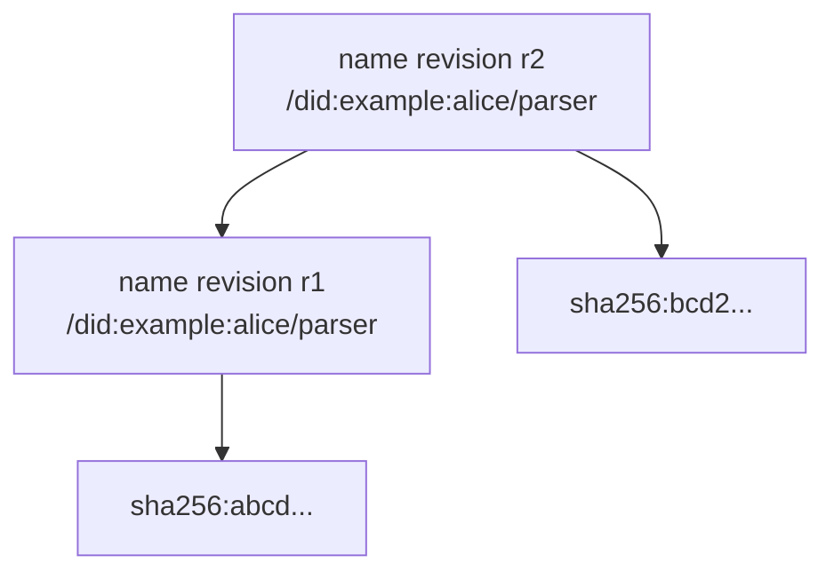
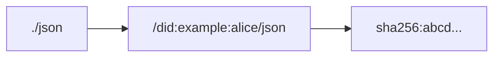
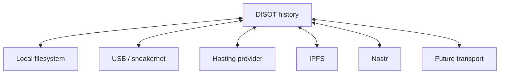

# DISOT

**Decentralized Immutable Source Of Truth**

## Documents

A [document](./doc-def.md) is a finite sequence of bits. A hash is its immutable global name.



The same document may have different filenames, URLs, or storage locations. Its content stays the same, and so does its hash for a given hash algorithm. The hash identifier can therefore serve as a permanent link without specifying a storage location or transport protocol.

Documents can reference other documents by hash:



This creates an immutable DAG.

## History Without Mutation

Changing a document creates a new document. A metadocument connects revisions:



```js
// r002...
export default {
    document: 'bcd2...',
    parents: ['d0c0...'],
}
```

Nothing is overwritten. Multiple parents represent a merge; multiple children represent forks.

## Authorship + Trusted Time



The timestamp covers the signed statement, not only the unsigned document:

```text
A = document
B = signature(hash(A), author DID)
C = trusted timestamp(hash(B))
```

Merkle trees can batch many signed documents under one trusted timestamp.

## Directories Are Documents

```js
export default {
    'a.js': 'abcd...',
    'subdir/b.js': 'ef01...',
}
```



Changing one path creates a new directory document. The old directory still exists.

## Global Names

### Immutable hash name

```text
sha256:abcd...
```

It identifies exactly one document.

### Evolving DID name

```text
/did:example:alice/parser
```

The name can evolve, but **the name history is immutable**:



A name is not a mutable pointer. Renames, transfers, forks, and conflicting updates remain visible in history.

## Relative Names

```text
base          = /did:example:alice/
relative name = ./json
result        = /did:example:alice/json
```

A Web of Trust can provide the context:

```text
~/alice/charlie/parser
```

`~` is the reader's root. Another reader may resolve `alice` differently.

Relative-name mappings also evolve through immutable revisions.

## Snapshots

Names evolve. Hashes do not.



A snapshot locks the resolution. Later name revisions do not change the dependency.

## One History, Many Transports

The same immutable history can move between systems, independently of any storage format or hosting provider.



Backup, restore, and synchronization should not require the service that originally stored the data.

**The transport can change. The documents, signatures, names, and history remain verifiable.**

## Projections

- [Git projection](./git.md): Git objects, signatures, names, snapshots, and transport examples.

## References

- Sergey Shandar, [Digital Space. How it should be Done](https://medium.com/@sergeyshandar/digital-space-how-it-should-be-done-4c2f3bd3cf9e), Medium, January 31, 2025.
